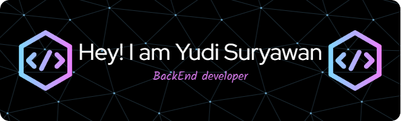

  

# 💫 About Me:

Hi there, I'm Yudi Suryawan 👋 I'm a Informatics and Computer Engineering Education student at Semarang State University with a passion for problem-solving, technology, and mathematics. I’m diving into the world of back end development , data science, and machine learning.  🌱 What I'm Learning: Improving my skills in JavaScript and Python. Exploring data structures and algorithms to solve complex problems  ✨ Fun Fact: I'm a big fan of logical games like Sudoku and enjoy challenges that let me think outside the box!

## 🌐 Socials:

  
  

# 💻 Tech Stack:

# 📊 GitHub Stats:

 
 

## 🏆 GitHub Trophies

### ✍️ Random Dev Quote

### 🔝 Top Contributed Repo

